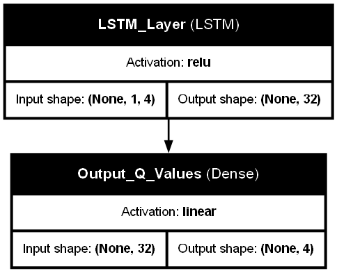

# Real-Time Demand Prediction and Adaptive Signal Control for a Critical Urban Intersection
### Offline DQN for Traffic Light Control in SUMO

This project implements an offline Deep Q-Network (DQN) agent to control a traffic light in a SUMO (Simulation of Urban MObility) environment. The agent is trained using data collected from SUMO simulations and aims to optimize traffic flow by minimizing vehicle waiting times.

## Overview

The core of the project is a DQN agent with an LSTM (Long Short-Term Memory) layer, designed to learn optimal traffic light phasing strategies from pre-collected simulation data. This offline approach allows for training without direct interaction with the SUMO environment during the learning phase, relying instead on a dataset of state-action-reward transitions.

The project includes:
- Scripts for generating simulation data (`sumo_data.py`).
- Scripts and notebooks for training the DQN agent (`dqn.py`, `dqn.ipynb`).
- Scripts for hyperparameter tuning using grid search (`gridsearch_dqn.py`).
- Scripts and notebooks for evaluating the trained agent against baseline methods (fixed-time, rule-based) (`evaluation.py`, `final_evaluation.py`, `evaluation.ipynb`, `final_evaluation.ipynb`).
- A script to visualize the neural network model architecture (`plot_model.py`).
- SUMO configuration files for the traffic scenario.

## Code Features 📄
- **Offline DQN Agent:** Learns from a static dataset of experiences.
- **LSTM Network Architecture:** Utilizes an LSTM layer to potentially capture temporal dependencies in traffic states.
- **SUMO Integration:** Uses SUMO for traffic simulation, data generation, and agent evaluation.
- **Baseline Comparison:** Includes rule-based and fixed-time agents for performance comparison.
- **Hyperparameter Tuning:** Provides a grid search script to find optimal hyperparameters.
- **Data Analysis & Visualization:** Jupyter notebooks for analyzing collected data and evaluation results.

## Prerequisites
- Python 3.11
- SUMO (Simulation of Urban MObility): Ensure SUMO is installed and the `SUMO_HOME` environment variable is set correctly.
- TensorFlow/Keras: `pip install tensorflow pandas numpy matplotlib seaborn`


## Usage / Workflow

1.  **SUMO Setup:**
    *   Ensure SUMO is installed and `SUMO_HOME` environment variable is set.
    *   The project uses `osm.net.xml` for the network and `route.rou.xml` for traffic generation.

2.  **Data Generation (Offline Dataset):**
    *   Run `sumo_data.py` to generate `sumo_data.csv`. This script likely uses a rule-based or random policy to interact with SUMO and log `(state, action, reward, next_state, done)` tuples.
    ```bash
    python sumo_data.py
    ```
    *   You can analyze the generated data using `analyze_data.ipynb`.

3.  **Model Training:**
    *   **Standalone Script:** Run `dqn.py` to train the DQN agent using `sumo_data.csv`. The trained model weights will be saved (e.g., to `offline_dqn_agent.weights.h5`).
        ```bash
        python dqn.py
        ```
    *   **Jupyter Notebook:** Alternatively, use `dqn.ipynb` for an interactive training experience and to visualize training loss.

4.  **Hyperparameter Tuning (Grid Search):**
    *   Modify `param_grid` in `gridsearch_dqn.py` with the desired hyperparameter ranges.
    *   Run the grid search:
        ```bash
        python gridsearch_dqn.py
        ```
    *   This will train multiple models with different configurations (using `refactored_trainer.py`), evaluate them (using `refactored_evaluator.py`), and save the results in `grid_search_results.json` and models in the `grid_search_models/` directory.

5.  **Model Evaluation:**
    *   **Initial Model:** Use `evaluation.py` to evaluate the model trained by `dqn.py`.
        ```bash
        python evaluation.py
        ```
    *   **Tuned Model:** Use `final_evaluation.py` to evaluate the best model found during grid search (update `MODEL_LOAD_PATH` in the script).
        ```bash
        python final_evaluation.py
        ```
    *   These scripts will run SUMO simulations with the loaded agent and generate `tripinfo_eval_*.xml` and `summary_eval_*.xml` files in their respective subdirectories (`tripinfo_eval/`, `summary_eval/`).
    *   The `rule-based_agent.py` can be run to generate baseline performance metrics.

6.  **Result Visualization & Comparison:**
    *   Use `evaluation.ipynb` to load and visualize the XML output files from `evaluation.py` and baseline runs.
    *   Use `final_evaluation.ipynb` to load and visualize results from `final_evaluation.py`, potentially comparing the tuned DQN agent with baselines and the initial DQN agent. This notebook is likely used for the final comparison charts.

7.  **Agent Simulation Visualization (GUI):**
    *   Modify `MODEL_LOAD_PATH` in `simulation.py` to point to your desired trained model.
    *   Ensure `SUMO_BINARY` in `simulation.py` is set to `sumo-gui` (or the path to your SUMO GUI executable).
    *   Run the script:
        ```bash
        python simulation.py
        ```
    *   This will launch SUMO in GUI mode, allowing you to observe the agent controlling the traffic light.

## Model Architecture

The DQN agent uses a Long Short-Term Memory (LSTM) network. The architecture is:
1.  **Input Layer:** Takes a sequence of states. Input shape: `(None, 1, 4)` (Batch size, Sequence length, State features).
2.  **LSTM Layer:** 32 units with ReLU activation. Output shape: `(None, 32)`.
3.  **Output Dense Layer:** 4 units (one for each action) with linear activation. Output shape: `(None, 4)`.



## Results and Analysis

Detailed evaluation results, including comparisons of average waiting time, trip duration, and throughput against baseline agents (Fixed-Time, Rule-Based), can be found in the Jupyter Notebooks:
- `final_evaluation.ipynb`: For comprehensive comparison including the tuned model from grid search.
- `analyze_data.ipynb`: For exploring the characteristics of the offline training dataset (`sumo_data.csv`).

The `grid_search_results.json` file contains the performance metrics for different hyperparameter configurations tested.
